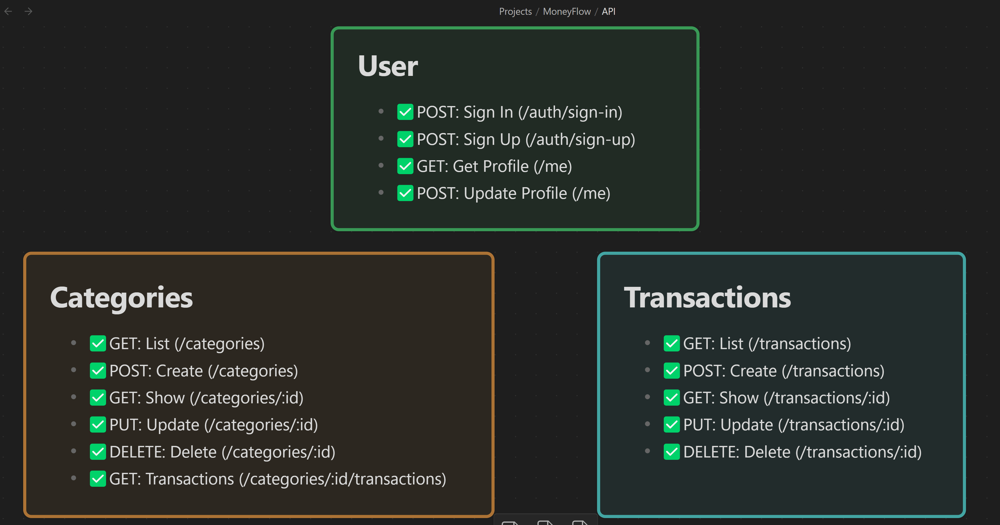
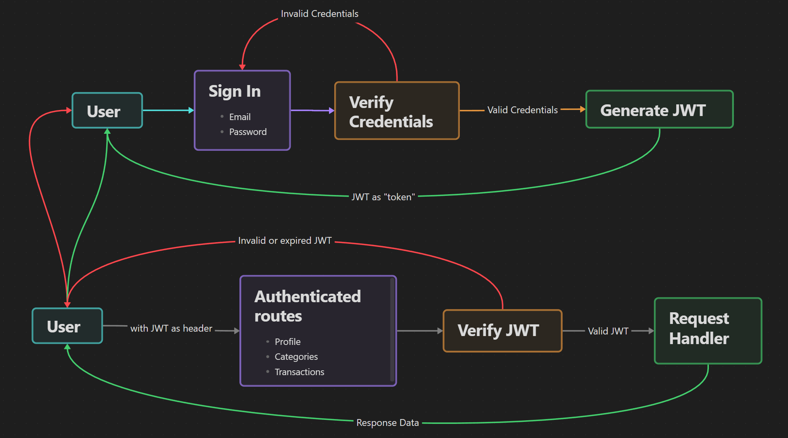
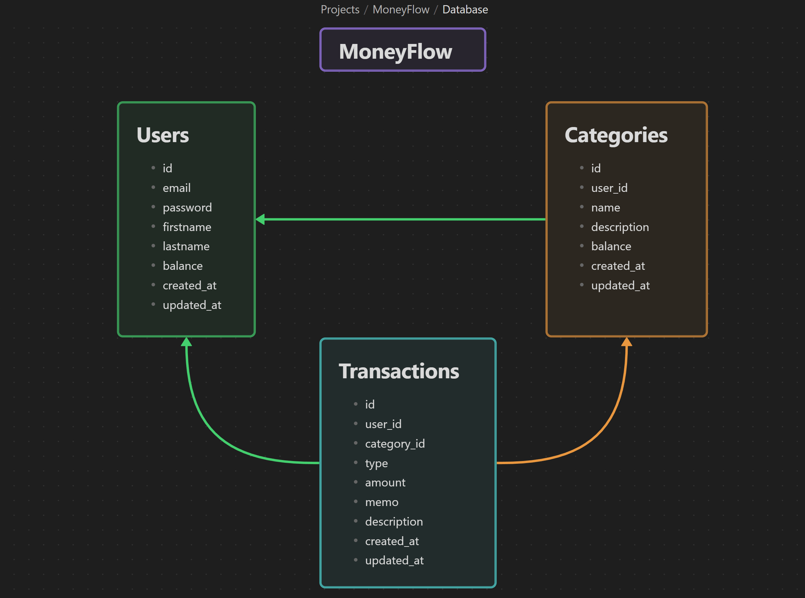

💵 MoneyFlow
============

MoneyFlow REST API Server in Rust with Actix Web, SQLx and JWT.

---

## Udemy Course
Learn about creating this in my Udemy course: [Creating an API server in Rust with Actix Web, SQLx and JWT by Afaan Bilal](https://www.udemy.com/course/rust-api-server-actix-sqlx-jwt/?referralCode=0C3C85FE260C2016C334).


---

### **Author**: [Afaan Bilal](https://afaan.dev)

---

## Run with Docker 

````
docker run --rm -it -p 8000:80 \
    -e DATABASE_URL=[DB URL] \
    -e JWT_SECRET=[RANDOM SECRET] \
    afaanbilal/moneyflow
````

> Note: When building the docker image yourself:
>
> - Set the host to `0.0.0.0` instead of `127.0.0.1`
> - Set the port to `80` instead of `8080`
>
> in `main.rs` (in the call to `.bind()`).

---

## Configuration
The following environment variables configure the server.

| Environment Variable | Default value | Description                          |
| :------------------- | :------------ | :----------------------------------- |
| DATABASE_URL         | `localhost`   | Database URL. Must be set.           |
| JWT_SECRET           | `[none]`      | The JWT signing secret. Must be set. |

---
## Run
````
cargo run
````
---

## API



| Method | Path                                | Auth? | Description                                          |
| :----- | :---------------------------------- | :---- | :--------------------------------------------------- |
| POST   | /auth/sign-up                       | ⬜     | Create a new account.                                |
| POST   | /auth/sign-in                       | ⬜     | Sign in. Returns a JWT on success.                   |
| GET    | /api/me                             | ✅     | Get the authenticated user's details.                |
| POST   | /api/me                             | ✅     | Update the authenticated user's details.             |
| GET    | /api/categories                     | ✅     | List categories of the authenticated user.           |
| POST   | /api/categories                     | ✅     | Create a category.                                   |
| GET    | /api/categories/`{id}`              | ✅     | Get the category with matching the `id`.             |
| PUT    | /api/categories/`{id}`              | ✅     | Update the category matching the `id`.               |
| DELETE | /api/categories/`{id}`              | ✅     | Delete the category matching the `id`.               |
| GET    | /api/categories/`{id}`/transactions | ✅     | List transactions in the category matching the `id`. |
| GET    | /api/transactions                   | ✅     | List transactions of the authenticated user.         |
| POST   | /api/transactions                   | ✅     | Create a transaction.                                |
| GET    | /api/transactions/`{id}`            | ✅     | Get the transaction with matching the `id`.          |
| PUT    | /api/transactions/`{id}`            | ✅     | Update the transaction matching the `id`.            |
| DELETE | /api/transactions/`{id}`            | ✅     | Delete the transaction matching the `id`.            |

## Authentication Flow



- **All auth required requests**: Add header `Authorization: Bearer [JWT]`.
- **Token lifetime**: 4 hours.


---

## Database Structure



---

## Contributing
All contributions are welcome. Please create an issue first for any feature request
or bug. Then fork the repository, create a branch and make any changes to fix the bug
or add the feature and create a pull request. That's it!
Thanks!

---

## License
**MoneyFlow** is released under the MIT License.
Check out the full license [here](LICENSE).
